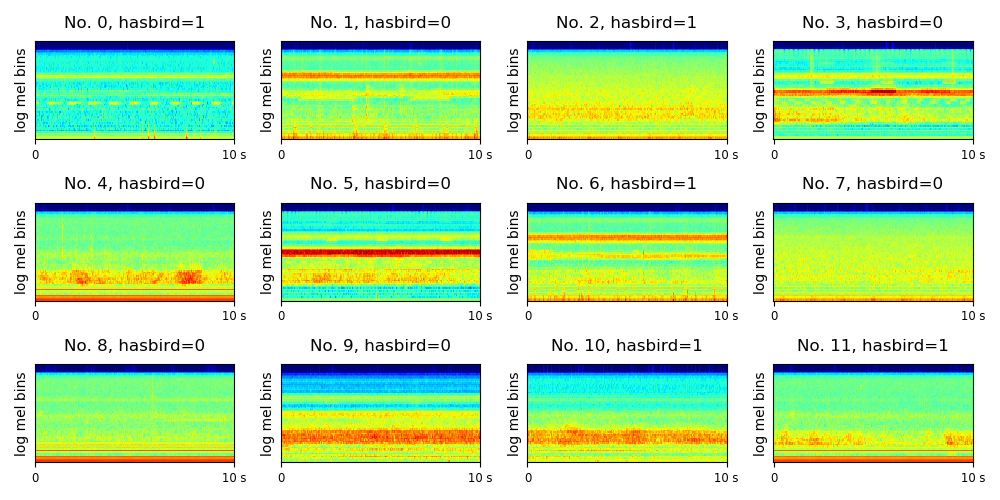

# DCASE 2018 Task 3 Bird audio detection

DCASE 2018 Task 3 bird audio detection is a challenge to detect the presence or the absence of birds in 10 second audio clips. We provide a convolutional neural network (CNN) baseline system implemented with PyTorch in this code base. More details about this challenge can be found in http://dcase.community/challenge2018/task-bird-audio-detection

## DATASET

The dataset is downloadable from http://dcase.community/challenge2018/task-bird-audio-detection

The development data consists of audio clips from freefield1010, warblrb10k and BirdVox-DCASE-20k. The evaluation data consists of audio clips from warblrb10k, Chernobyl and PolandNFC dataset. 

### Statistics of development data

| Dataset name      | Number of audio clips |
|-------------------|:---------------------:|
| freefield1010     |          7690         |
| warblrb10k        |          8000         |
| BirdVox-DCASE-20K |         20000         |
| **Total**         |         **35690**     |

### Statistics of test data

| Dataset name | Number of audio clips |
|--------------|:---------------------:|
| warblrb10k   |          2000         |
| Chernobyl    |          6620         |
| PolandNFC    |          4000         |
| **Total**    |         **12620**     |

The log mel spectrogram of the scenes are shown below:

The names of the audios are:
<pre>
No. 0, 00053d90-e4b9-4045-a2f1-f39efc90cfa9.wav
No. 1, 000db435-a40f-4ad9-a74e-d1af284d2c44.wav
No. 2, 001059c0-e04f-42fc-a8e2-11aad24dc6fb.wav
No. 3, 00106202-f61e-467d-a80f-070d90421952.wav
No. 4, 00129593-77ca-40b2-a512-75d178071250.wav
No. 5, 00143c1f-bcac-47f6-a83d-81b2975ccca3.wav
No. 6, 00160fdf-5231-461b-acd7-1db41abf3ee5.wav
No. 7, 00162d26-57e6-4924-a247-5f58963f1403.wav
No. 8, 001ac3fe-c23a-4366-a16d-8d59f021b17e.wav
No. 9, 001ac895-0e9c-41d8-a76c-65c73c4a8d11.wav
No. 10, 001b8d8a-4247-4c46-a11b-b868fa3edb0a.wav
No. 11, 001d5212-6378-4a5d-aa3c-b1115d02ee79.wav
</pre>

## Run the code

**0. Prepare data**
Unzip all development wavs to 'wav' folder, unzip all testing wavs to 'test_wav' folder. The data looks like:

<pre>
.
├── wav (35690 audios for development)
│    └── ...
├── test_wav (12620 audios for testing)
│    └── ...
├── BirdVoxDCASE20k_csvpublic.csv
├── ff1010bird_metadata_2018.csv
├── warblrb10k_public_metadata_2018.csv
└── dcase2018_task3_bird_examplesubmission.csv
</pre>

**1. (Optional) Install dependent packages.** If you are using conda, simply run:

$ BACKEND="pytorch"

$ conda env create -f $BACKEND/environment.yml

$ conda activate py3_dcase2018_task3

(We developed this system with python 3. If you are using pytorch as backend then pytorch 0.4.0 is required.)

**2. Then simply run:**

$ ./runme.sh

Or run the commands in runme.sh line by line, including: 

(1) Modify the paths of data and your workspace

(2) Extract features

(3) Train model

(4) Evaluation

The training looks like:

<pre>
Load hdf5 time: 7.787177562713623 s
Training audios: 15690
Validation audios: 20000
iteration: 0, train time: 0.005 s, validate time: 40.426 s
tr_acc: 0.574, tr_auc: 0.691, 
va_acc: 0.510, va_auc: 0.532
------------------------------------
iteration: 500, train time: 99.674 s, validate time: 41.741 s
tr_acc: 0.896, tr_auc: 0.959, 
va_acc: 0.551, va_auc: 0.746
------------------------------------
......
------------------------------------
iteration: 1000, train time: 99.984 s, validate time: 42.196 s
tr_acc: 0.914, tr_auc: 0.970, 
va_acc: 0.596, va_auc: 0.735
------------------------------------
......
</pre>

## Result

We apply a convolutional neural network on the log mel spectrogram feature to solve this task. Training takes around 200 ms / iteration on a GTX Titan X GPU. The model is trained for 5000 iterations. The result is shown below. 

In development, we split the data to 3 fold, each fold contains the audios from a dataset. The cross validation result is shown as below:
 
  

| Dataset           | Validation AUC |
|-------------------|----------------|
| freefield1010     | 0.799          |
| warblrb10k        | 0.782          |
| BirdVoxDCASE-20K  | 0.882          |
| **Average**       | **0.854**      |

## Summary
This codebase provides a convolutional neural network (CNN) for DCASE 2018 challenge Task 3. 

## FAQ
If you met running out of GPU memory error, then try reduce batch_size. 

### External link

The official baseline system implemented using Keras can be found in https://github.com/DCASE-REPO/dcase2018_baseline
